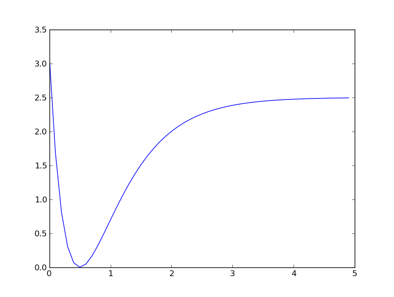

<script type="text/javascript"
  src="https://cdn.mathjax.org/mathjax/latest/MathJax.js?config=TeX-AMS-MML_HTMLorMML">
</script>

# A taste of SciPy

## Olav Vahtras

Leiden 2015-04-14

---

layout: false

### Learning objectives

* Overview of the SciPy library

* Minimizing

* Curve fitting

* Least-square optimization


---

## Example

In the examples below we use the Morse potential



```python
def morse(r, r0=0.5, a=1.5, d=2.5):
    import math
    e = math.exp(-a*(r-r0))
    return d*(1-e)**2
```
Interpretation

* `r0`: minimum
* `a`: inversly related to width
* `d`: asympototic


---

## Methods for function minimization

* A very common problem in science
* Associated to the variational principle
* A model parameterized function that minimized some criterion

### The Brent method

* Bracketing approach
* No derivatives

```
scipy.optimize.brent(f)
```

### Conjugant gradient method

* Gradient function can be given
* Approximate gradient  used if not

```
scipy.optimize.fmin_cg(f)
```
--

With gradient
```
scipy.optimize.fmin_cg(f, [1], fprime=g)
 ```  

---

### The Newton method


* Based on a local second-order expansion

* Iterative method
```
    x = x_0 - f'(x_0)/f''(x_0)
```

* Hessian is optional - numerical requires more gradient evaluations
```
minx = optimize.fmin_ncg(f, [1], fprime=g)
```
* with Hessian
```
optimize.fmin_ncg(f, [1], fprime=g, fhess=h)
```

---

### The quasi-Newton method
* some approximation of the Hessian is maintained
* when the Hessian is too expensive

```
optimize.fmin_bfgs(f, [1], fprime=g)
```
--

### The lBFGS

* inprinciple as BFGS - does not store explicit Hessians

```
optimize.fmin_l_bfgs_b(f, [1], fprime=g)
```

---


## Curve-Fitting Illustration

* Consider the Morse example ``d=2.5, a=1.5 r0=0.5``
* Add some numerical noise
* Given input numerical data the optional parameters (r0, a, d) are optimized to fit data

```
x = numpy.arange(0, 5, .1)    
y = f(x) + 0.01*numpy.random.normal(size=len(x))
optimize.curve_fit(f, x, y)
```

---

### Least-Square fitting

* Simple least square fitting to a straight line
* Initialize arrays
```python
import numpy
from scipy.optimize import leastsq
x = numpy.arange(0, 10, .01)
k0 = 3.0
l0 = 1.0
y = k0 * x + l0 + numpy.random.randn(len(x))
```
* Define a residual function
* The parameters to be optimize are the first argument (tuple)
```python
def resid(p, y, x):
   k,l = p
   return y - k*x - l
```

* The arguments to `leastsq` are the residual function, the initial parameters `p0` and the data set `(y, x)` in `args` 
```python
p0 = numpy.array([k0, l0])
scipy.optimize.leastsq(resid, p0, args=(y, x))
```
 
---

## Integration

* uses package `scipy.integrate`
* definite integrals in 1-3 dimensions

### Example

The integral of a Gaussian distribution

```python
from scipy.integrate import quad
sqrtpi = math.sqrt(math.pi)
def e2(x):
   return math.exp(-x*x)
scipy.integrate.quad(e2, -10, 10)
```

---

### Other SciPy submodules

* Special functions

* Interpolation

* Linear algebra

* Statistics

Links:

* http://docs.scipy.org/doc/
* http://scipy-lectures.github.com
